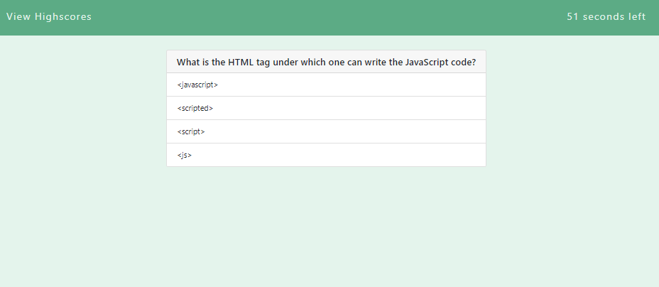

# Diana Shull's Timed Quiz

* Press to start the quiz
* Answer each question before the timer runs out
* If you answer all questions before the timer runs out you can enter your initials for a high score
* If you fail to answer all the questions before the timer runs out then you get a notification saying that lost

# Link to deployed site

* [JavascriptQuiz](https://dianalynshull.github.io/Timed-Quiz/)

## Description

* This site allows you to test your knowledge of javascript to see if you can beat your high scores!

## Requirements for Project

* GIVEN I am taking a code quiz
* WHEN I click the start button
* THEN a timer starts and I am presented with a question
* WHEN I answer a question
* THEN I am presented with another question
* WHEN I answer a question incorrectly
* THEN time is subtracted from the clock
* WHEN all questions are answered or the timer reaches 0
* THEN the game is over
* WHEN the game is over
* THEN I can save my initials and score
## Acknowledgments

Inspiration, code snippets, etc.

* READ ME INSPIRATION
    * [DomPizzie](https://gist.github.com/DomPizzie/7a5ff55ffa9081f2de27c315f5018afc)

* SITES USED
    * [Quiz-Questions-From](https://www.geeksforgeeks.org/javascript-quiz-set-1/)
    * [Removing-Elements](https://www.abeautifulsite.net/adding-and-removing-elements-on-the-fly-using-javascript)
    * [Paletton](https://paletton.com/#uid=1310u0k7yJW29Wr4-QZaXBpeJuN)
    * [EventListenerReading](https://developer.mozilla.org/en-US/docs/Web/API/EventTarget/addEventListener)

* COLLABORATOR
    * Diego Hernandez